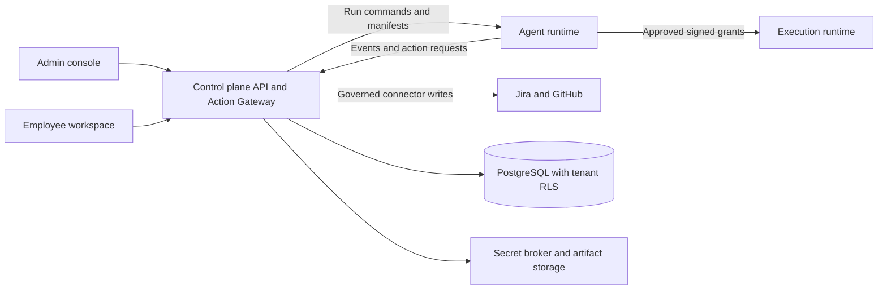

# Agents Foundry

[](https://github.com/Agents-Foundry/employee-agent-platform/actions/workflows/ci.yml)

**Give AI employees a role, a scope and accountable human ownership.**

Agents Foundry is a governed AI employee platform for engineering organizations. Administrators install versioned role packages and assign individual agents to employees. Separate runtimes carry out the work, while the control plane enforces identity, resource scope, spending limits, approvals and retained evidence.

This repository contains the product implementation: the admin console, employee workspace, control-plane API, agent runtime, execution runtime and shared governance packages.

[Product website](https://agents-foundry.github.io/employee-agent-website/) · [Technical documentation](https://agents-foundry.github.io/employee-agent-platform-docs/) · [Architecture decisions](docs/adr/)

## What the platform does

- **Organize and assign:** nested organizational units, people, job roles and positions; organization memberships; a live setup checklist; catalog installations and employee-bound agent instances.
- **Execute specialist work:** a native agent kernel, Anthropic model adapter, Jira work-item reads and issue creation, repository checkout, scoped file changes, project scripts, Playwright and approved draft GitHub pull requests.
- **Govern every action:** Ed25519-signed manifests, registered runtime identities, deterministic policy, expiring approvals bound to the exact request, and single-use execution grants.
- **Keep credentials under organizational control:** model and connector secret references, a Vault KV v2 provider, brokered model credentials and short-lived credentials for private repository checkout.
- **Recover and retain evidence:** durable checkpoints, runtime heartbeats and lease recovery, managed artifacts in local or S3-compatible storage, browser traces/screenshots and integrity checks.
- **Operate with evidence:** model token/cost budgets, budget alerts and webhooks, role evaluations, metrics/traces, failure drills, reconciliation screens, generated dashboards/alerts and deployment validation.

### Built-in engineering roles

The catalog ships five role identities across seven blueprint versions. They share the same governance and execution infrastructure.

| Role                     | Representative workflow                                               |
| ------------------------ | --------------------------------------------------------------------- |
| QA Engineer              | Validate a story, run approved browser checks and file a defect       |
| Frontend Engineer        | Implement and verify a UI change, then request a draft pull request   |
| Backend Engineer         | Implement and verify an API change, then request a draft pull request |
| Code Reviewer            | Review a change and produce findings                                  |
| Test Automation Engineer | Author and verify regression tests, then propose the changes          |

Definitions live in [packages/catalog](packages/catalog/src/index.ts). Each version pins its skills, tools and workflows by digest; updating the catalog does not silently change an existing agent's manifest. See the [catalog guide](docs/agent-catalog.md).

## Architecture



The control plane authorizes work. The agent runtime selects tools and manages model context. The execution runtime verifies grants before operating in a thread-owned workspace. Organizational job roles describe work; they do not grant application security privileges.

| Component             | Location                          | Responsibility                                                                                     |
| --------------------- | --------------------------------- | -------------------------------------------------------------------------------------------------- |
| Admin console         | `apps/control-plane-web`          | Organization setup, catalog installations, assignments, policies, approvals and reconciliation     |
| Employee workspace    | `apps/employee-desktop`           | Agent selection, conversations and QA task submission; Angular UI with a Tauri 2 shell             |
| Control-plane API     | `apps/control-plane-api`          | Authentication, tenant data, catalog, action authorization, credentials, checkpoints and artifacts |
| Agent runtime         | `apps/agent-runtime`              | Native kernel, model gateway, tools, approval pause/resume and recovery                            |
| Execution runtime     | `apps/execution-runtime`          | Granted workspace operations, container sandbox, egress proxy and execution evidence               |
| Shared packages       | `packages/`                       | Contracts, catalog, policy engine, web authentication, telemetry, operations and readiness         |
| Operating definitions | `operations/`, `pilot-readiness/` | Rendered dashboards/alerts and test-backed readiness criteria                                      |

PostgreSQL uses forced row-level security on tenant tables and separate login roles for tenant work, cross-tenant platform operations and schema migrations. See [ADR 0018](docs/adr/0018-postgresql-row-level-security.md).

## Quick start: local demo

Prerequisites: **Node.js 24**, **npm 11** and **Docker**. Native desktop development also needs Rust and the [Tauri system prerequisites](https://v2.tauri.app/start/prerequisites/).

```bash
git clone https://github.com/Agents-Foundry/employee-agent-platform.git
cd employee-agent-platform
npm ci
cp .env.example .env
npm run db:dev
npm run db:bootstrap
```

In PowerShell, use `Copy-Item .env.example .env` instead of `cp`. The example environment contains development-only database credentials. `db:dev` starts PostgreSQL 16 on `127.0.0.1:55433`; the API applies pending migrations at startup using `DATABASE_MIGRATION_URL`.

Start these in **three separate terminals**, from the repository root:

| Process              | Command                  | Local address                      |
| -------------------- | ------------------------ | ---------------------------------- |
| Demo API             | `npm run dev:api:demo`   | `http://localhost:4100/api/health` |
| Admin console        | `npm run start:admin`    | `http://localhost:4200`            |
| Employee web preview | `npm run start:employee` | `http://localhost:4300`            |

This starts the local demo UI and API. Generic model/tool execution requires the runtime configuration below; it is disabled in the default environment. Use `npm run tauri:dev` for the native desktop shell after installing its prerequisites.

### Authentication and organization setup

`npm run dev:api` defaults to Google authentication and requires explicit OAuth and membership configuration. Follow the [Google Workspace guide](docs/google-workspace.md).

Password-mode organizations are provisioned through a trusted operator CLI. Administrators activate through single-use links, then manage people, organizational units, jobs, positions and agent assignments. Existing accounts can link organization invitations and switch active memberships. Follow [customer onboarding](docs/customer-onboarding.md) and the [organization implementation ledger](docs/diy-organization-platform.md) for the supported flows and their boundaries.

### Enable live agent execution

Configure the control plane, agent runtime and execution runtime before enabling work. The commented settings in [.env.example](.env.example) are the configuration starting point.

| Control-plane flag                   | Default | Effect                                                                    |
| ------------------------------------ | ------- | ------------------------------------------------------------------------- |
| `AGENT_MANIFEST_V2_ISSUANCE_ENABLED` | `false` | Issue v2 manifests for newly provisioned agents                           |
| `GENERIC_AGENT_RUNTIME_ENABLED`      | `false` | Allow employees to submit generic runs                                    |
| `QA_GENERIC_RUNTIME_ENABLED`         | `false` | Route eligible v2 QA agents through the generic `validate-story` workflow |

1. Generate and register Ed25519 workload identities, pin the control-plane verification key and authorize runtimes for the intended organizations and profiles.
2. Configure organization-managed model credentials and the role's connector, repository and environment scopes. The live model adapter is Anthropic; choosing another provider in metadata does not install an adapter.
3. Configure the execution runtime, its grant verification key, container images and egress proxy. Use the container provider for sandboxed work; the local provider is a development option with fewer isolation guarantees.
4. Enable the appropriate flags, restart the API and create/install agents with the required manifest version. Existing v1 agents are not converted by a flag change.
5. Start `npm run dev:execution` and `npm run dev:runtime` in separate terminals, alongside the API and UIs.

The [agent runtime guide](docs/agent-runtime.md), [execution runtime guide](docs/execution-runtime.md), [manifest reference](docs/agent-manifest-v2.md) and [Action Gateway guide](docs/action-gateway.md) cover keys, registration and configuration. Starting the processes without those prerequisites is not an execution setup.

## An end-to-end QA run

With a configured organization installation, a v2 QA agent and generic QA execution enabled:

1. An employee selects their verified assigned agent and submits a story key and configured QA target.
2. The control plane records the conversation, thread and run; an authorized runtime claims the work.
3. The runtime reads the Jira story and checks out the scoped repository.
4. A Playwright request pauses for human approval. On approval, the execution runtime verifies a single-use grant and runs the tests.
5. If checks reveal a defect, Jira issue creation requests a separate, payload-bound approval.
6. The run retains collected reports and browser evidence, records action outcomes and updates the employee conversation. A failed browser check can be useful QA evidence within a completed workflow.

Without the generic QA flag or a qualifying manifest, the legacy static planning flow remains available. See the [QA runtime decision](docs/adr/0014-qa-on-the-generic-runtime.md) and [provisioning guide](docs/provisioning.md).

## Security and operational boundaries

- Unknown actions, invalid manifests, unresolved credentials, expired approvals and out-of-scope resources are refused. Organization overrides can require approval or deny an action; they cannot weaken platform defaults.
- Playwright execution, Jira issue creation and publishing a draft pull request require human approval. Production deployment is denied to employee agents.
- Live server-side model calls use `ORGANIZATION_MANAGED` credentials. `EMPLOYEE_BYOK` is represented in configuration but is refused by the current runtime.
- Private checkout credentials are redeemed by the execution runtime for the authorized repository; models and the agent runtime do not receive them.
- An external write with an uncertain outcome is blocked from being repeated until an administrator checks the external system and records **Applied** or **Not applied** in **Writes to reconcile**. That screen does not retry the write.
- MCP execution, external role-package loading, a complete self-service setup wizard and granular custom security roles are not implemented. The employee UI remains focused on QA; broader role workflows use the generic APIs.

See the [security model](docs/security.md), [failure handling](docs/failure-handling.md) and implementation-backed [technical documentation](https://agents-foundry.github.io/employee-agent-platform-docs/). Early architecture documents and ADRs retain their milestone context; compare their status statements with the current source.

## Build, test and evaluate

```bash
npm run check
```

CI runs the same command: build both Angular apps and the three backend processes, run the web/API/runtime/execution test suites, then compute pilot readiness from the recorded test results.

| Command                | Purpose                                                                               |
| ---------------------- | ------------------------------------------------------------------------------------- |
| `npm run build`        | Build the applications and runtimes                                                   |
| `npm run test`         | Run the full test suite and write readiness inputs                                    |
| `npm run test:evals`   | Run the role governance and quality-evaluation test suites                            |
| `npm run eval:quality` | Run live model-quality evaluations with explicitly configured credentials and budgets |
| `npm run readiness`    | Assess existing test results against `pilot-readiness/assessment.json`                |

Control-plane tests start a disposable PostgreSQL container unless `TEST_DATABASE_ADMIN_URL` points to a test server. Docker is also needed for sandbox/egress tests. Live model-quality evaluation is separate from ordinary CI and can incur provider charges; the [Model quality workflow](.github/workflows/quality.yml) supports scheduled and manual runs when configured.

Readiness reports use `GREEN`, `AMBER` and `RED`, and CI retains `.readiness/pilot-readiness-report.json` as the `pilot-readiness` artifact. Passing repository checks does not establish that a deployment's Vault, object store, collector or sandbox is correctly configured. See [pilot readiness](docs/pilot-readiness.md).

## Operate a controlled pilot

The latest operator tooling lives in [packages/operations](packages/operations/src/) and [operations](operations/).

```bash
# Render dashboards and alert rules from the metric catalog.
npm run ops:render

# Validate each host using that deployment's environment and secret references.
npm run pilot:validate -- --scope control-plane
npm run pilot:validate -- --scope execution-host
```

`ops:render` writes provider-neutral definitions, Prometheus rules and a Grafana dashboard. Deployment-specific thresholds can be supplied with `--thresholds`; use `--out` to render into a separate directory. Start with [alert-thresholds.example.json](operations/alert-thresholds.example.json).

`pilot:validate` checks the selected host's database connectivity, migration set and RLS roles, Vault health secret, object-store round trip, OTLP export, workload identities, signing/grant verification, model credentials, runtime reachability, sandbox/egress setup and feature flags as applicable to its scope. Database probes use read-only transactions; service probes make dedicated health-check requests and temporary object/container operations. The command writes a scrubbed JSON report to `.readiness/operational/pilot-validate.json` and exits nonzero when a check fails. Run the scopes on their respective hosts and retain their reports separately if collecting both.

Traces correlate work across all three backend processes. Token-protected `/metrics` endpoints and OTLP export support monitoring of runs, models, budgets, approvals, reconciliation, secrets, artifacts and execution. Use [observability](docs/observability.md) and [failure handling](docs/failure-handling.md) to configure monitoring and administrator procedures.

## Documentation and contribution

- [Technical knowledge base](https://agents-foundry.github.io/employee-agent-platform-docs/) — reader journeys, API references, role guides and implementation status.
- [Organization setup](docs/diy-organization-platform.md), [agent assignment](docs/admin-agent-assignments.md) and [catalog installations](docs/agent-catalog.md).
- [Runtime transport](docs/runtime-protocol.md), [artifact storage](docs/artifacts.md) and [migration plan](docs/migration-plan.md).
- [Architecture decision records](docs/adr/) — design rationale and historical decisions.

For a change, run the affected checks and `npm run check`, update the relevant documentation and include validation evidence. Add new catalog versions rather than editing registered versions, and preserve applied database migrations and signing-key continuity. Keep credentials, activation links, runtime keys and generated local state out of Git.
