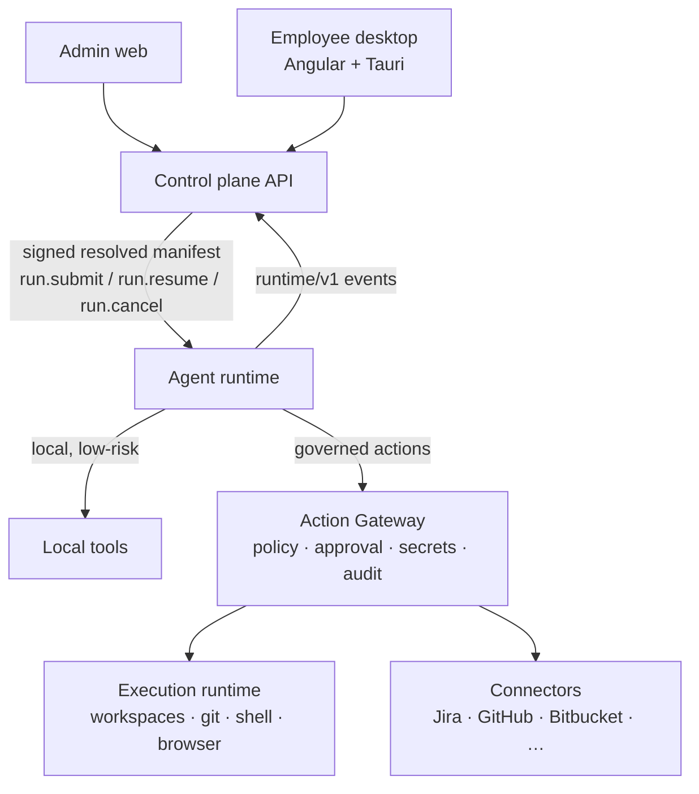

# Architecture V2 — governed AI employee platform

Agents Foundry is an operating system for governed AI employees. Four concerns stay separate:

| Concern               | Decides                                                                                                           | Lives in                                    |
| --------------------- | ----------------------------------------------------------------------------------------------------------------- | ------------------------------------------- |
| **Control plane**     | Who the employee is, its organization, permitted work, resources, approvals, secrets, policies, retained evidence | `employee-agent-platform` (this repository) |
| **Agent runtime**     | How the employee reasons, uses skills, tools, models and MCP, and manages context                                 | `apps/agent-runtime` (Phase C, ADR 0011)    |
| **Execution runtime** | Where potentially dangerous work executes                                                                         | `execution-runtime` (Phase E)               |
| **Role packages**     | What kind of employee it is                                                                                       | `<role>-agent` repositories (declarative)   |



## Current state (after Phase A)

Only the control-plane portion exists. The diagram's runtime, gateway, execution and connector
boxes are **design**, not implemented. Phase A delivered the control-plane contracts and records
that those components will use:

```text
Conversation ─┐
              └── Thread (agent_threads)
                    └── AgentRun (agent_runs) ── task, manifest ref, status machine
                          ├── RunStep (agent_run_steps)
                          ├── AgentEvent (agent_events, append-only)
                          ├── ApprovalRequest (approvals.run_id)
                          └── Artifact (agent_artifacts, metadata + storage reference)
```

- [Runtime protocol](runtime-protocol.md): `agents-foundry/runtime/v1` commands and events.
- [Agent Manifest v2](agent-manifest-v2.md): resolved, signed runtime configuration.
- [Artifacts](artifacts.md): evidence metadata and storage references.
- [Migration plan](migration-plan.md): phases, flags and exit criteria.
- [Gap analysis](architecture-v2-gap-analysis.md): repository-grounded baseline.
- [Agent runtime](agent-runtime.md): host, kernel, model gateway, tools and transport (Phase C).
- [Action Gateway](action-gateway.md): governed action decisions, approvals, execution and connectors (Phase D).
- ADRs [0002](adr/0002-separate-agent-runtime-from-control-plane.md)–[0012](adr/0012-action-gateway-execution.md).

## Subsystem designs (not implemented)

Each subsystem gets its own document in the phase that implements it, so design text does not
drift from code. Until then these summaries are binding constraints:

- **Catalog (Phase B, implemented; see [agent-catalog.md](agent-catalog.md)).** A global `AgentBlueprintVersion` is installed per organization
  (`OrganizationAgentInstallation`, with connector and project customization) and instantiated per
  employee (`AgentInstance`, `EmployeeAgentAssignment`). The result is resolved into a signed
  `ResolvedAgentManifest`. Blueprint updates create new versions and never mutate active manifests.
- **Skills and tools (Phase B/C).** Skills are independently versioned packages (instructions,
  examples, templates, input/output schemas, requirements, activation rules, eval cases). Tools
  publish id, version, schemas, risk, execution location, permissions, side effects and timeout.
  Definition, implementation, permission and invocation are separate objects.
- **MCP (Phase C+).** `McpServerDefinition`, `McpInstallation`, `McpToolDefinition`,
  `McpRuntimeConnection`. MCP tools are filtered by manifest, organization policy, employee
  permissions and scope. An unknown MCP tool is denied.
- **Model gateway (Phase C, minimal slice implemented; see [agent-runtime.md](agent-runtime.md)).** `ModelProfile` / `ModelProvider` / `ModelCapability` /
  `ModelRoutingPolicy`. Roles request profiles, not SDKs. Credential mode stays `EMPLOYEE_BYOK` or
  `ORGANIZATION_MANAGED`. The database stores secret references only, and the runtime receives
  short-lived or brokered credentials.
- **Action Gateway and Policy v2 (Phase D, implemented; see [action-gateway.md](action-gateway.md)).** Contextual, deterministic evaluation over actor,
  organization, agent, task, resource, environment, manifest and prior approvals. Output is
  `ALLOW | REQUIRE_APPROVAL | DENY` plus risk, reason, `policyId`, `policyVersion` and conditions.
  Unknown actions are denied, and an unavailable policy engine denies governed writes.
- **Execution runtime (Phase E).** `ExecutionProvider` (`LocalExecutionProvider` first) with
  timeouts, CPU, memory, process, filesystem and network limits, workspace ownership and audit.
- **Memory and context (Phase C+).** `MemoryProvider` interfaces per scope (conversation,
  thread, project, employee, organization, skill). A Context Manager assembles bounded context
  with token budgeting. No vector database lock-in.
- **Connectors (Phase D+).** Typed capability contracts (`IssueTrackerConnector`,
  `SourceControlConnector`, …) with provider implementations. Connectors hold no authorization logic.
- **RBAC.** Granular permissions (`Permission`, `OrganizationSecurityRole`, `AgentPermission`,
  `ResourceScope`) are kept separate from organizational job roles. Security access is never
  inferred from a job title.

## Security principles (unchanged and binding)

Unknown action, unresolved secret, invalid manifest, expired approval, wrong organization,
missing workspace ownership, unknown MCP tool, or unavailable policy engine for a governed write:
all result in **DENY**. No raw secrets reach conversations, browsers, logs or audit metadata.
Organization IDs come from the authenticated session, never from the client. Agents cannot
mutate their own permissions.

## Observability (design)

Every run carries the correlation chain `organizationId → employeeId → agentId → threadId →
runId → stepId → toolCallId → actionId`. The runtime protocol envelope already carries it (see
`RuntimeCorrelation`). Metrics and traces are future work.
