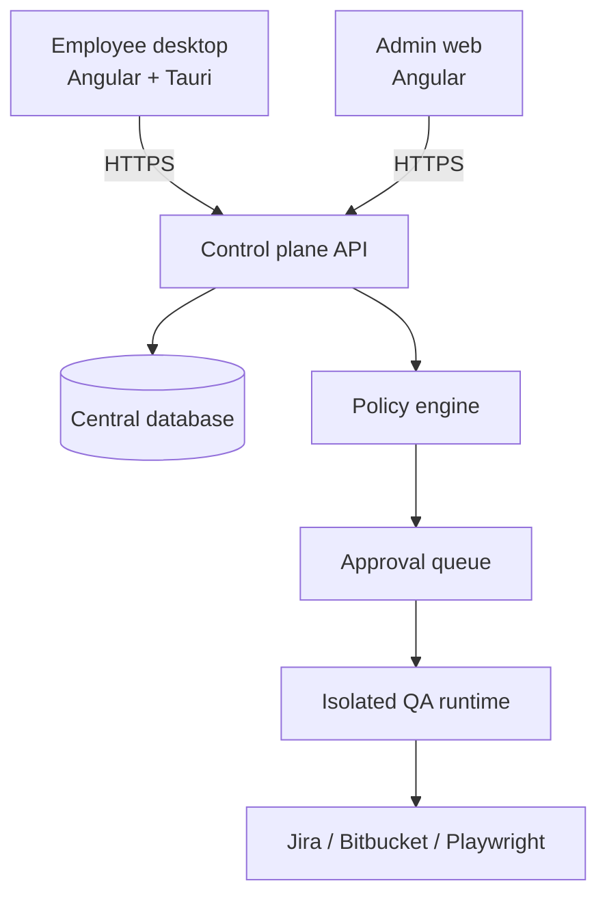

# Architecture

## Runtime topology

The desktop is not trusted with organization credentials or policy decisions. It submits intent to the control plane. The control plane authenticates the actor, evaluates policy, writes the audit event, and either executes, blocks, or requests approval.

## Domain boundaries

| Boundary            | Owns                                               | Must not own                            |
| ------------------- | -------------------------------------------------- | --------------------------------------- |
| Employee desktop    | Conversation UX, task intent, local OS shell       | Raw organization keys, policy decisions |
| Admin control plane | Catalog, assignments, approvals, policy visibility | Runtime secrets                         |
| Control-plane API   | Authorization, persistence, audit, orchestration   | Long-running browser processes          |
| Policy engine       | Deterministic action decisions                     | User interface state                    |
| Isolated runtime    | Ephemeral checkout and tool execution              | Approval authority                      |
| Vault               | Encrypted secret material                          | Business workflow state                 |

## First vertical slice

The implemented slice proves the control path rather than pretending that a generated plan has already executed:

`QA request → central conversation → policy evaluation → approval record → admin decision → READY/REJECTED run state`

The next slice consumes `READY` runs in an isolated Playwright worker and uploads evidence artifacts.
