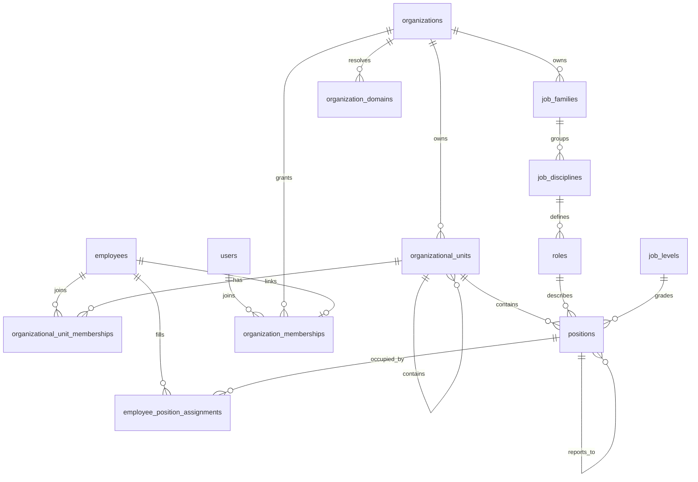

# DIY organization platform — implementation ledger

## Gap analysis against the master implementation brief

The current repository is Angular standalone applications, an Express API, and Node SQLite.
It is **not** a Supabase/PostgreSQL application and has no Supabase migrations. Preserve this
working architecture until a separately planned datastore migration is justified.

Already implemented before this milestone: cookie sessions, Google Workspace pilot login,
password-only tenant onboarding through an operator CLI, mandatory password initialization
through single-use activation links, invitation/recovery lifecycle, organization-scoped employees,
signed QA agent provisioning, private employee assignments, action approvals and lifecycle audit.

Remaining: platform-admin authentication/UI, granular RBAC,
tenant suspension controls, setup wizard, work/technology/integration catalogs, configurable
policies and organization-derived agent readiness. Existing free-text team fields are not a
substitute for the organizational hierarchy. Existing `employees.role` is an application access
role, not a job role. Existing QA model preferences do not represent live model execution.

## Phase 1 — in progress

### Implemented vertical slices

- Organization structure: create, edit, move, archive and browse arbitrary nested units.
- Ten supported unit types; no customer-specific hierarchy is seeded in production.
- Tenant-scoped memberships: multiple units per employee, one primary unit, lead/manager labels.
- Independent job families, disciplines, job roles, configurable levels and positions.
- Positions link a unit, job role and level and optionally report to another position.
- Server-side filtering, stable sorting, bounded pagination and tenant-scoped search pickers.
- Reactive forms, loading/error/empty states, archive confirmations and optimistic version checks.
- Atomic administration writes with before/after immutable change events.
- Editable organization profiles, DNS verified domains and host scoped tenant resolution.
- Distinct global login users, tenant employee records and explicit organization memberships.
- Employees without logins, later invitation, and historical occupied position assignments.

### Database changes and migrations

`src/migrations/001-organization-structure.ts` adds `organizational_units`,
`organizational_unit_memberships`, `organization_change_events` and supporting indexes/triggers.
`002-job-architecture.ts` adds `job_families`, `job_disciplines`, `roles`, `job_levels`, `positions`.
`003-profiles-identities.ts` adds profile fields, `users`, `organization_memberships`,
`organization_domains` and `employee_position_assignments`. Existing identities are backfilled
to distinct user IDs; employees without logins remain unlinked.
`schema_migrations` records versions, SQL checksums and applied timestamps. Each migration runs
inside `BEGIN IMMEDIATE`; failures roll back and changed applied migrations fail closed.
The pre-existing baseline schema remains in `database.ts`; no existing table is duplicated.
Startup applies pending migrations automatically. Back up the SQLite database and signing key
before deployment. Test a copy first; never edit an applied migration or drop tables to roll back.
These additive migrations preserve existing tenant, employee, agent and manifest identifiers.

### API

All routes below require an authenticated, enabled password-mode organization administrator.
The tenant is derived from the session; client organization/actor/security-role fields are rejected.

| Route under `/api/organization` | Methods | Purpose |
| --- | --- | --- |
| `/units` | GET, POST | Filtered list, create |
| `/units/:id` | PUT | Edit/move with required `version` |
| `/units/:id/ancestors` | GET | Tenant-scoped breadcrumb path |
| `/units/:id/archive` | POST | Soft archive with required `version` |
| `/units/:id/members` | GET, POST | Paginated memberships, add membership |
| `/units/:id/members/:membershipId` | DELETE | Remove active membership; retain audit |
| `/units/employee-options` | GET | Paginated employee picker |
| `/jobs/:kind` | GET, POST | List/create families, disciplines, roles, levels, positions |
| `/jobs/:kind/:id` | PUT | Version-checked update |
| `/jobs/:kind/:id/archive` | POST | Dependency-checked soft archive |
| `/profile` | GET, PUT | Versioned organization profile |
| `/domains` | GET, POST | List/register domains |
| `/domains/:id/verify` | POST | Verify DNS TXT proof |
| `/domains/:id/primary` | POST | Select verified primary domain |
| `/employees` | GET, POST | Paginated people directory; create without login |
| `/employees/:id` | PUT | Edit employment |
| `/employees/:id/position` | PUT | Assign or end position, retaining history |
| `/employees/:id/invitation` | POST | Invite a recorded employee |
| `/memberships` | GET | Tenant login memberships |
| `/memberships/:id/status` | PUT | Suspend/reactivate membership |

List parameters: `page`, `pageSize` (maximum 100), `search`, `status`, `sort`.
Unit lists additionally accept `unitType` and `parentId` (`root` for top-level units).
Neither unit leads nor job roles grant application privileges.

### Tenant isolation and invariants

Every new business table carries `organization_id`; reference pairs use composite foreign keys
to prevent cross-tenant parents, members, positions and job dependencies. Each service rechecks
the administrator against live enabled identities. Origin protection and session handling are
reused. Unknown input keys are rejected. SQL values are bound, and dynamic identifiers are
limited to static allow-lists. SQLite has no native PostgreSQL RLS: these constraints and
server authorization must not be described as RLS or as protection from a database superuser.

Login identity (`users`) is separate from tenant employment (`employees`) and the explicit
access grant (`organization_memberships`). Session checks require all three, the login
identity and the organization to be active. Deactivating employment ends its current position
and suspends login membership. A position is a unique seat; reassignment closes the old row
and preserves the history. Job roles do not grant application access.

Domains are globally unique and normalized to ASCII. To verify ownership, the admin adds a
TXT record at `_agents-foundry-verification.<domain>` matching the generated challenge.
Only verified domains resolve to tenants; login and session checks on their hostnames are
restricted to that tenant. Deployment must supply DNS address records, HTTPS certificates and
reverse-proxy routing. Domain registration does not configure those services.

Circular unit and position hierarchies are rejected by database triggers. A job role's discipline
must belong to its selected family. Active dependants block archival. New dependencies must be
active; moving a discipline to an incompatible family is rejected. Change-event UPDATE/DELETE
is blocked by triggers; database-file administrators can still bypass those controls. Off-system
tamper-evident retention is a later governance capability, not delivered here.

### Verification

Automated tests cover complete service/API flows, foreign tenant reads/writes/references,
forged roles, strict input validation, cycles, stale versions, duplicate codes/memberships,
primary-unit uniqueness, archive dependencies, migration restart persistence/checksums and
database-level immutable audit. Angular tests cover bounded lists, tenant-free mutation payloads,
conflicts and required position dependencies. Existing auth, provisioning, recovery and
employee tests remain in the full check suite.

Browser verification uses a disposable in-memory database and isolated loopback server, not the
user's live Google tenant. Verified child-department creation, breadcrumb context, family and
discipline creation through a server-backed picker, and persistence across browser reload.

### Known limitations and remaining Phase 1 work

- The legacy employee email column remains globally unique. One person cannot yet link
  employment in several organizations through the self-service UI. A future account-linking
  flow needs verified consent and tenant switching; an email match alone must not grant access.
- DNS, TLS and routing must be configured by the deployment operator. Google OIDC remains
  directory-managed and does not support custom-domain callbacks in this phase.
- Existing free-text team fields remain for compatibility. Existing signed manifests are unchanged.
- Unit head-position links, dated memberships, restore/archive lifecycle and imports are pending.
- Tree view is paginated, one-level drill-down, not an expandable drag-and-drop tree.
- New screens are password-mode only; Google pilot identities remain file-managed.
- The new immutable audit store has no dedicated administration viewer yet.
- SQLite and the current single API process have not been validated for thousands of tenants.
- This does not complete Phase 1 or the full master acceptance scenario.

### Sequential continuation

1. Finish broader Phase 1: verified cross-organization account linking, tenant switching,
   unit head positions, dated memberships, and setup progress.
2. Phase 2: central permission model, platform-vs-tenant security, lifecycle gates and tenant status.
3. Phase 3: separately authenticated platform provisioning UI, suspension/reactivation and recovery.
4. Phase 4: persisted setup wizard/readiness, with real dependency checks rather than percentages.
5. Phase 5: finish people CRUD and work/repository/environment administration.
6. Phase 6: catalog/install separation for integrations and external secret references.
7. Phase 7: structured policy/approval rules, audit viewer and retention.
8. Phase 8: tenant agent definitions, context resolution and fail-closed readiness before activation.

Do not label any of these future phases complete because schema stubs exist. Each needs its
own tested API, UI and security lifecycle. Platform support access must never be inferred from
platform-administrator status; customer secrets/conversations remain outside that boundary.
